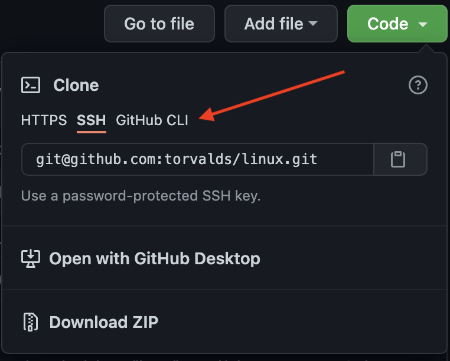
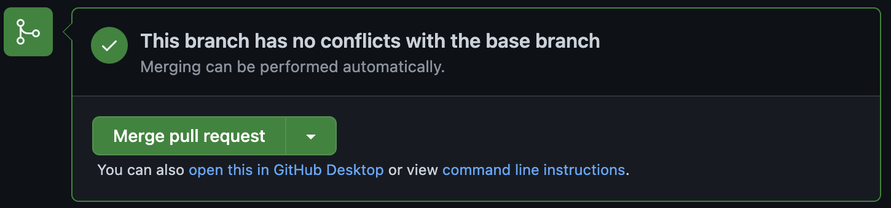

# The Basics of Git
## Craig Reeder
---

# Who am I?

Craig Reeder

Senior Cloud Engineer @ *Uturn Data Solutions*

---
# I love tooling

---
# I *really* love tooling

---
# Git is one of my favorite tools

---
# What is Git?

Distributed Version Control Software

---
# History

Created by Linus Torvalds in 2005

*(To manage Linux source code)*

Note:
Though it's been largely developed by others since

---
# Quick Note: GitHub

GitHub is just a hosted platform for Git repositories

---


Git is to GitHub as Burgers are to BurgerKing

---
# What does git *do*?

---
# Tracks changes

---
# Keeps history

---
# Enables collaboration

Everyone has a full copy

Note:
This has proved useful for recovery purposes

---
# Why use git?

---
# Ever done this?

```
project/
    config-4.3.20
    config-1.5.21
    config-7.8.21
    config-live
```

---
# Never do that again!

---
# Git has history

All changes
*(since the beginning of time)*

---
# Easily reversable

---
# Who broke it?

```
$ git log

Author: Travis Langhals <tlanghals@example.com>
Date:   Fri Sep 3 12:13:57 2021 -0400

Remove the Fizz from the Buzz, it's not needed
```

*(spoiler alert: it was needed)*

---
# Great! How do I use it?

---
# Creating a new repository

```bash
$ git init
```

Note:
This creates a new repository in the current directory

---
# Time to make some changes


---
# Staging Changes

To save your changes, you need to tell git you want to include them

Note:
This feels silly, but this means that you can select which changes to actually save, or break them into smaller chunks

---
# Stage your changes

```bash
$ git add foo.html bar.js
```

---
# Commit your changes

```bash
$ git commit
```

This will prompt you in an editor for a message.

*(It is possible to change which editor it uses.)*

---

 <!-- .element: class="fullscreen" -->

---
# Don't have commitment issues

---
# Commit early and often


---
# It's not that easy! I got lost!

---
# Check status

```bash
$ git status
```

---
# Status Output

```
On branch main
Changes not staged for commit:
  (use "git add <file>..." to update what will be committed)
  (use "git restore <file>..." to discard changes in working directory)
  modified:   index.html
  modified:   themes/dark.css
```

---
# Working locally
## A cheat sheet

```bash
$ git init # once, for a new repo

# make changes to files
$ git add file.txt
$ git commit
```

---
# Now let's work as a team

---
# Getting an existing repository

```bash
$ git clone git@github.com:torvalds/linux.git
```

---
# Quick Note: Auth

SSH:
```bash
$ git clone git@github.com:torvalds/linux.git
```

HTTPS:
```bash
$ git clone https://github.com/torvalds/linux.git
```

---
# Clone URL Selection



Select it here on GitHub

---
# SSH vs HTTPS

- SSH relies on the key you already created
- HTTPS will prompt you for credentials every time
  *(Unless you set up a credential manager)*
- SSH works better with most automation

---
# Back to the commands

---
# Getting updates

Someone made a change to a repository you cloned

*Oh no! What do I do? 😢*

---
# Pull changes from remote

```bash
$ git pull
```

---
# Now you're up to date!


---
# Stage your changes

```bash
$ git add foo.html bar.js
```

---
# Commit your changes

```bash
$ git commit
```

---
# Commiting is local only

---
# Share your changes

```bash
$ git push
```

Note:
The first time you do this in a branch, you'll get an error message with an additional flag. Follow the instructions.

---
# One more important concept

---
# Git is a tree


*(sometimes displayed sideways)*

---
# Trees have branches

---
# Git has branches!


*(and a trunk)*

Note:
You'll hear tree terminology used a lot around git

---
# Default branch

The default branch is usually *main*

*(Sometimes it's called "master")*

Note:
It'll be master if you init on your machine. This is a simple configuration option.

---
# Create a new branch

```bash
$ git branch widget-fix
```

---
# Change to a branch

```bash
$ git checkout widget-fix
```

---
# Merging

Merging is the act of combining branches

---
# We're not going to cover manually merging

---
# Pull Requests

With most hosted Git platforms, you can create a pull request

---
# What's that?

This is a request to merge your branch into another

*(Typically main)*

---
# Review!

Best practice with a pull request is to have someone else review your code

---
# GitHub has useful commenting and approval tools

---
# Let's talk about flows

---
# Github Flow

1. Make a feature branch
2. Make your changes
3. Commit your changes
4. Push your changes
5. Make a Pull Request
6. Fix any feedback from review (repeat 2-4)
7. Merge the PR

---
# Step 1: Make a feature branch

```bash
$ git branch widget-fix
$ git checkout widget-fix
```

---
# Step 2: Make your changes


---
# Step 3: Commit your changes

```bash
$ git add fixed-files.txt
$ git commit
```

---
# Step 4: Push your changes

```bash
$ git push
```

---
# Step 5: Make a PR


---
# Step 6: Fix feedback

Fix any feedback from reviews

*(And repeat steps 2-4: make changes, commit, push)*

---
# Step 7: Merge the PR



*(The final reviewer will likely do this step)*

---
# GitHub Flow Summary

1. Make a feature branch
2. Make your changes
3. Commit your changes
4. Push your changes
5. Make a Pull Request
6. Fix any feedback from review (repeat 2-4)
7. Merge the PR

---
# Some final thoughts

---
# VSCode is git aware

Note:
It will show you what has changed since your last commit

---
# VSCode Integration

All of the git commands can be done in VSCode with context menus

*(Look for the "source control" icon on the left)*

Note:
While I prefer the commandline, this is an easy way to get started.

---
# .gitignore

*.gitignore* is a special file that tells git which files to ignore.

Those files won't ever be staged or commited

---
# Questions?

---
<!-- .slide: class="compact" -->
# Now for some hands on!

Try these commands (or do the following in VSCode):

```bash
$ git init # once, for a new repo
$ git add file.txt # create file.txt first
$ git commit
$ git status
$ git branch widget-fix
$ git checkout widget-fix

$ git clone <url> # new repo! get this from github
$ git branch your-username
$ git checkout your-username
$ git add file.txt # create file.txt first
$ git commit
$ git push # follow the instructions
```

---
# Thank you!
