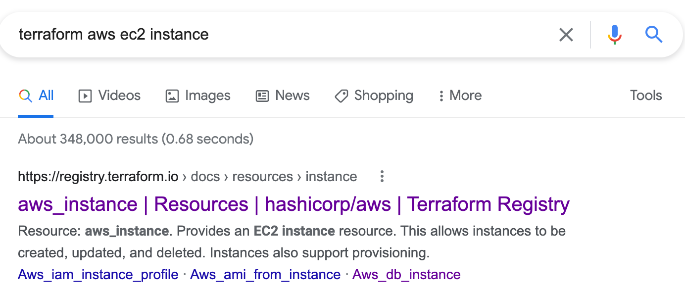

# Introduction to OpenTofu/Terraform
## Craig Reeder
---

# Who am I?

Craig Reeder

Senior Cloud Engineer @ *Uturn Data Solutions*

---

# I write a lot of OpenTofu & Terraform

It changed the way I think about infrastructure and configuration.

---

# What is Terraform?

It is an infrastructure as code provisioning tool.

Originally written in 2014, it quickly became the most popular way to provision infrastructure.

---

# What does that *mean*?

It means that your infrastructure is represented *as code*.

---

# Why?

Allows provisioning to be automated, repeatable, and less error prone.

---

# What is OpenTofu?
OpenTofu is an open source fork of Terraform

OpenTofu forked in August, 2023 after Terraform announced it would move from an open-source license (MPL) to the Business Source License.

Note: For the purposes of this training, OpenTofu and Terraform are interchangable. This training will refer to OpenTofu as that is the primary tool I prefer and use.

---

# Why do we prefer OpenTofu?

- Is Open-Source and Community Governed
- Member project of the CNCF
- Implemented long-awaited wish list items missing from Terraform

Note: Why do we prefer OpenTofu over Terraform

---

There's a lot of tools that do IaC


---

# Why not those?
- Cross-platform
- Cloud-agnostic
- Popular

Note: While we primarily use it for AWS, it can be used for much, much more.
This has lots of benefits as far as community support and documentation

---

# So lets learn some TF!

---

# First, some important concepts

---

# What's a Provider?

Providers connect OpenTofu to the underlying infrastructure

OpenTofu is just a tool to execute those providers

The provider performs the "magic" of converting configuration to the result

---

# Common Providers

We're going to be talking about the AWS provider.

Other common ones are PostgreSQL, Cloudflare, and Kubernetes.

---

# Dominos Provider?


You can order pizza with OpenTofu

---

# What is a Resource?

A resource is one or more infrastructure objects that is implemented by the provider

---

# Resources are the bread and butter of OpenTofu

---

```hcl
resource "aws_instance" "example" {
  ami           = data.aws_ami.ubuntu.id
  instance_type = "t3.micro"

  tags = {
    Name = "ExampleServer"
  }
}
```

Note: Resource - Type of resource - identifier of resource.

---

# Resources have parameters

Parameters are for configuring a resource

---

`ami`, `instance_type`, and `tags` are parameters here

```hcl
resource "aws_instance" "example" {
  ami           = data.aws_ami.ubuntu.id
  instance_type = "t3.micro"

  tags = {
    Name = "ExampleServer"
  }
}
```

---

# Resources have attributes

Attributes get information out of a resource

---

`private_ip` is the attribute here

```hcl
resource "aws_instance" "example" {
  ...
}

# You can later use this value
aws_instance.example.private_ip
```

---

# How do I know which parameters and attributes exist?

---

# The Terraforn & OpenTofu Registries have provider documentation

---

# Google search tends to work better for the registry

Note: For example, search "Terraform AWS EC2 Instance"

---



---

# Input Variables

Input variables allow for changing configuration values

---

```hcl
variable "username" {
  type = string
  description = "Username to apply the changes to"
  default = "Steve"
}

# You can later use this value
var.username
```

---

# Variables can be set in a number of ways

- environment variables
- tfvars files
- passed during apply

---

# Unset variables

If a variable doesn't have a default and isn't set it will prompt you on apply

---

# Variables cannot change during runtime

---

# Local Values

Local values allow for a static value to be set during runtime

Note: These are kind of like constants in other programming languages

---

```hcl
locals {
  department = "Operations"
  # ...
  # you can also define more here
}

# You can later use this value
local.department
```

---

# Output Values

Note: Can you guess what output values are?

---

# Output values do exactly what they sound like

Note: They allow you to get information out of the tf easily

---

```hcl
output "public_ip" {
  value = aws_instance.example.public_ip
}
```

---

# Data Source

Data sources allow you to get information from a remote location into your code

Data sources are implemented by providers, much like resources

---

# Example

A common data source is to get the most recent version of an AMI

---

```hcl
data "aws_ami" "windows_server_2019" {
  most_recent = true
  owners      = ["amazon"]

  filter {
    name   = "name"
    values = ["Windows_Server-2019-English-Full-Base-*"]
  }
}

# You can later use this value
# Note the "image_id" attribute here
data.aws_ami.windows_server_2019.image_id
```

---

# State Files

OpenTofu keeps track of what it creates.

That information is stored in a state file.

Note: This statefile contains all of the information about any resources created

---

# *Never* modify the statefile directly

Corrupting your state means that OpenTofu *doesn't know what exists*

---

# That's bad
It may create *new* copies of infrastructure, or *destroy* the existing ones

---

# Local state storage

Without configuration, statefiles are stored locally

*(In a file called "terraform.tfstate")*

---

# Remote state storage
In AWS, we use *S3 buckets* (Object storage)

This enables collaboration and safety

---

# Modules

Modules allow you to reuse OpenTofu code multiple times, in multiple places

Kind of like a software library

---

# Controlling modules

Modules use *input variables* as their parameters and *output values* as attributes

---

# Modules can do a lot

Modules can define multiple resources, or use multiple data sources

Modules are written in the same OpenTofu code that projects are written in

Note: They can do anything any other OpenTofu code can do

---

# Modules can be sourced remotely or locally

Note: This tells OpenTofu where to find the code for a module

---

```hcl
# This is just an identifier for local access,
# not the name of the module
module "servers" {
  # This is a local "relative" source reference
  source = "../modules/example-cluster"

  servers = 5 # Module's input variables are parameters
}

# Modules's outputs become attributes
# (you can use this elsewhere)
module.servers.ip_list
```

---

# How do you use a module?

To know a modules *parameters* and *attributes*, you need to refer to it's documentation (or code)

---

# Quick Note: tenv

tenv is an OpenTofu / Terraform version manager

This will allow different versions and tools where appropriate

---

# tenv `tf` alias

`tf` is an alias in tenv for either Terraform or OpenTofu depending on the folder's contents

Specifically, an `.opentofu-version` or `.terraform-version` file

---

# Now what?

We've written some OpenTofu code now

How do we actually apply it?

---

# First, you need to initialize
```bash
$ tf init
```

This sets up the neccessary providers and downloads modules

---

# You don't need to init everytime
OpenTofu will generally tell you if it's needed again

---

# To see the changes OpenTofu will make:
```bash
$ tf plan
```

Planning will show you what OpenTofu will change on apply, but will not change anything

---

# Ready to make your infrastructure changes?
```bash
$ tf apply
```

This will prompt you for confirmation

---

# Some Final Notes

---

# File Names

- Filenames don't matter in OpenTofu (only extensions)
- All files with *.tf* or *.tofu* will be combined for the apply

---

# Remote State Locking
Two people can't apply the same project at the same time

---

# Official Language
- In OpenTofu, every folder is a "module"
- A "root module" is a module that is applied directly
- A "child module" is one that is referenced
- U:Turn typically uses slightly different language

---

# We Say →  Docs
Projects → Root Modules

Stacks → Child Modules

Modules → Child Modules

---

# Questions?
